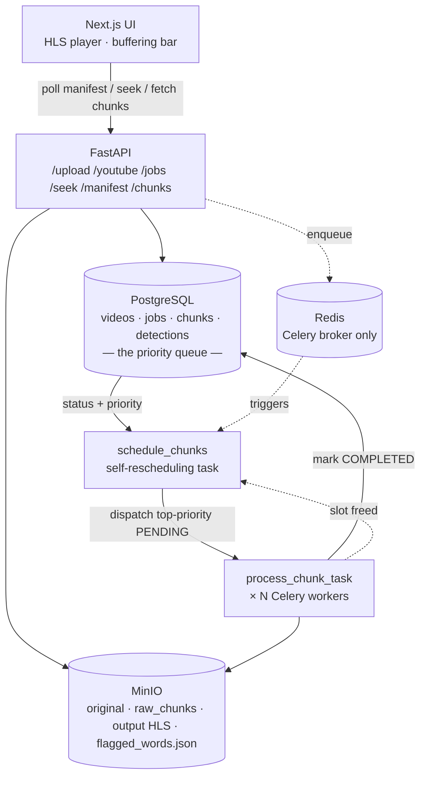
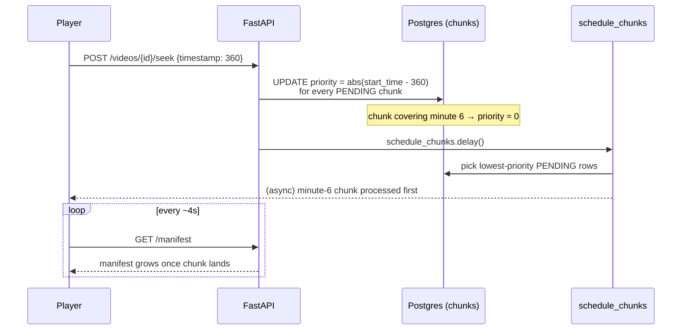
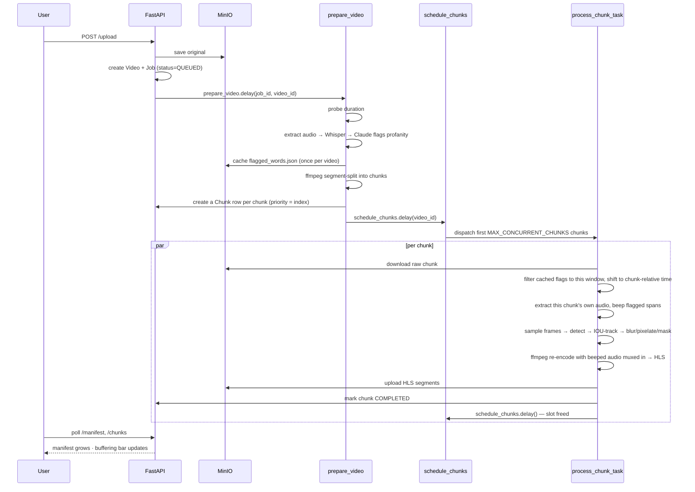

# Video Censorship Pipeline — Architecture

A chunked video processing system where the user can scrub ahead into
unprocessed footage, and the backend reprioritizes work on the fly so that
chunk arrives first — without re-queuing or losing the chunks already done.

## 1. System overview

The frontend is a Next.js app that plays video through `hls.js` while
polling the backend for a growing manifest and a chunk-status bar. The
backend is FastAPI, backed by three stores: **Postgres** holds the
video/job/chunk state machine, **Redis** is purely the Celery broker, and
**MinIO** holds every binary artifact — the source upload, raw chunks, the
output HLS segments, and a cached transcript-flag file.



## 2. Why Postgres is the priority queue, not Redis

Celery/Redis queues are FIFO — once a task is sitting there, nothing moves
it to the front. So chunks are never bulk-dispatched into Celery directly.
Instead every chunk is a row in `chunks`, and re-prioritizing a chunk is
just an `UPDATE`.

- Each row carries `status` — pending, processing, completed, or failed.
- Each row carries `priority` (float, lower = sooner).
- `schedule_chunks` only ever dispatches up to `MAX_CONCURRENT_CHUNKS` at a
  time — whichever `PENDING` rows have the lowest priority.
- It re-runs after every chunk completes (a worker slot frees up) and after
  every `/seek` call (priorities just changed).

Nothing ever has to be pulled back out of Redis mid-flight — Redis only
ever sees "a slot is free, go ask Postgres what's next."

## 3. What a seek actually does

The user is watching a 10-minute video, processed up through minute 2, and
drags the scrubber to minute 6.



A scrub **back** to minute 3 — already completed before the jump — touches
nothing: `/seek` only reprioritizes `PENDING` rows, so the completed chunk
is already in the manifest and playback is instant.

## 4. Fresh upload → first frame



### Two pipelines, two cadences

| Pipeline | Runs | What it does |
|---|---|---|
| **Visual** | Per chunk, every time | NudeNet / violence / blood detectors → IOU tracker stabilizes boxes across frames → blur, pixelate, or mask the tracked region. |
| **Audio** | Once per video, cached | Whisper transcribes the full track; Claude flags profane word spans; result cached to `flagged_words.json` in MinIO. Each chunk later slices its own window from that cache and beeps it — no re-transcription per chunk, and audio stays synced because each chunk extracts and beeps its own audio track. |

## 5. Project structure

```
video-censorship/
├── frontend/                    Next.js — upload UI, HLS player, buffering bar
│   ├── app/
│   │   ├── page.tsx
│   │   ├── upload/page.tsx
│   │   └── video/[jobId]/page.tsx
│   ├── components/
│   │   ├── VideoPlayer.tsx      hls.js, manifest polling, seek → /seek
│   │   └── BufferBar.tsx        renders chunk status as a colored bar
│   └── lib/api.ts               typed fetch wrappers for the backend API
│
├── backend/                     FastAPI + Celery — API + orchestration
│   └── app/
│       ├── api/                 videos.py, jobs.py, streaming.py (manifest)
│       ├── models/               video.py, job.py, chunk.py, detection.py
│       ├── schemas/              pydantic I/O models
│       ├── services/             storage.py (MinIO), youtube.py (yt-dlp),
│       │                          transcript_cache.py (cached Whisper output)
│       └── workers/
│           ├── celery_app.py
│           └── tasks.py         prepare_video / schedule_chunks / process_chunk_task
│
├── processor/                   Pure processing logic (no FastAPI/DB imports
│   │                             except where tasks.py wires it in)
│   ├── video/                   chunker.py, frame_sampler.py
│   ├── detection/                nudenet.py, violence.py, blood.py (stubbed),
│   │                              detector.py (merges all three)
│   ├── tracking/                 tracker.py (IOU tracker)
│   ├── censorship/                blur.py, pixelate.py, mask.py
│   ├── audio/                     transcriber.py (Whisper), ai_detector.py
│   │                              (Claude), censor.py (beep)
│   ├── pipeline/                  chunk_pipeline.py (one chunk: detect→track→
│   │                              censor→encode), audio_pipeline.py (whole-
│   │                              video transcribe+detect, cached)
│   └── utils/ffmpeg.py           all ffmpeg/ffprobe subprocess wrappers
│
├── docker/Dockerfile.worker      Celery worker image (bundles backend + processor)
├── docker-compose.yml
└── .env.example
```